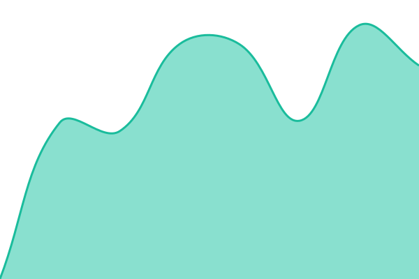
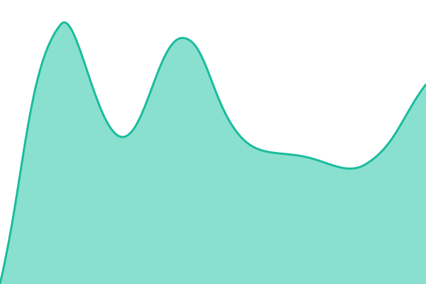

# [📈 Live Status](https://status.cod3rocket.com): <!--live status--> **🟩 All systems operational**

This repository contains the open-source uptime monitor and status page for [Cod3Rocket](https://cod3rocket.com), powered by [Upptime](https://github.com/upptime/upptime).

With [Upptime](https://upptime.js.org), you can get your own unlimited and free uptime monitor and status page, powered entirely by a GitHub repository. We use [Issues](https://github.com/cod3rocket/status/issues) as incident reports, [Actions](https://github.com/cod3rocket/status/actions) as uptime monitors, and [Pages](https://status.cod3rocket.com) for the status page.

<!--start: status pages-->
<!-- This summary is generated by Upptime (https://github.com/upptime/upptime) -->
<!-- Do not edit this manually, your changes will be overwritten -->
<!-- prettier-ignore -->
| URL | Status | History | Response Time | Uptime |
| --- | ------ | ------- | ------------- | ------ |
|  [Auth](https://auth.cod3rocket.com) | 🟩 Up | [auth.yml](https://github.com/cod3rocket/status/commits/HEAD/history/auth.yml) | 

 1838ms
     
 | 

<a href="https://status.cod3rocket.com/history/auth">98.72%</a>
    

|  [Omnichannel](https://chatwoot.cod3rocket.com) | 🟩 Up | [omnichannel.yml](https://github.com/cod3rocket/status/commits/HEAD/history/omnichannel.yml) | 

 833ms
     
 | 

<a href="https://status.cod3rocket.com/history/omnichannel">98.73%</a>
    

|  [Typebot](https://typebot.cod3rocket.com) | 🟩 Up | [typebot.yml](https://github.com/cod3rocket/status/commits/HEAD/history/typebot.yml) | 

 625ms
     
 | 

<a href="https://status.cod3rocket.com/history/typebot">98.73%</a>
    

|  [Valinor](https://valinorcrm.com) | 🟩 Up | [valinor.yml](https://github.com/cod3rocket/status/commits/HEAD/history/valinor.yml) | 

 718ms
     
 | 

<a href="https://status.cod3rocket.com/history/valinor">98.74%</a>
    

|  [Wakapi](https://wakapi.cod3rocket.com) | 🟩 Up | [wakapi.yml](https://github.com/cod3rocket/status/commits/HEAD/history/wakapi.yml) | 

 1112ms
     
 | 

<a href="https://status.cod3rocket.com/history/wakapi">98.75%</a>
    

|  [Invoice](https://invoice.cod3rocket.com) | 🟩 Up | [invoice.yml](https://github.com/cod3rocket/status/commits/HEAD/history/invoice.yml) | 

 678ms
     
 | 

<a href="https://status.cod3rocket.com/history/invoice">98.75%</a>
    

<!--end: status pages-->

[**Visit our status website →**](https://status.cod3rocket.com)

## 📄 License

- Powered by: [Upptime](https://github.com/upptime/upptime)
- Code: [MIT](./LICENSE) © [Anand Chowdhary](https://anandchowdhary.com), supported by [Pabio](https://pabio.com)
- Data in the `./history` directory: [Open Database License](https://opendatacommons.org/licenses/odbl/1-0/)
